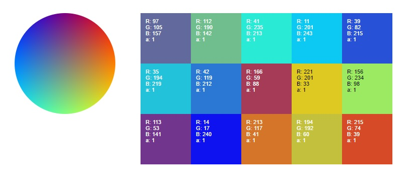

# A minimal color-palette generator, written in javascript.

A live demo may be found [here](http://104.236.97.183/).

## How does it work?

### The Math

The dominant colors of a given image are found using a [k-means clustering algorithm](https://en.wikipedia.org/wiki/K-means_clustering).

### The Code

Originally written in Python and deployed using Flask (old code can be found [here](https://github.com/justinmao/palette/tree/master/flask)), it is now rewritten in javascript and deployed using Angular 2 on the frontend and Express over Node.js on the backend as a web API.

### But wait, that can't possibly be efficient! Wouldn't it take forever for requests to go through?

Yes, absolutely. Although performing terribly (especially under load of many simultaneous requests), the goal of this project was to become more familiar with the frameworks, design, and programming.

## To be implemented:

* Accept image upload as a source.
* Sanitize input (server currently crashes on invalid url/color number)/proper error handling.
* Remove backend entirely.

